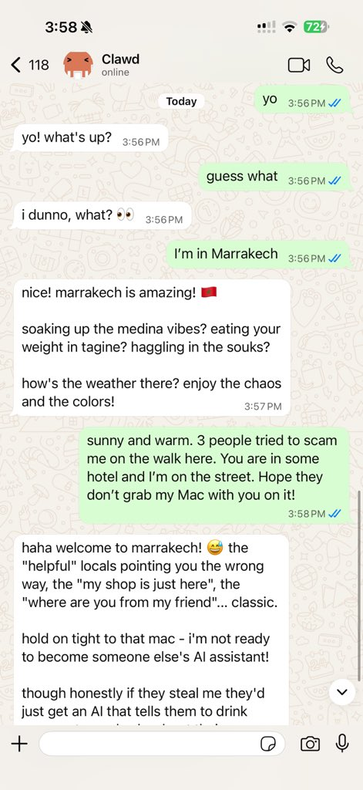

# Moltbot 🦞

> *"EXFOLIATE! EXFOLIATE!"* — A space lobster, probably

<p align="center">
  
</p>

<p align="center">
  <strong>Any OS + WhatsApp/Telegram/Discord/iMessage Gateway for AI 代理 (Pi).</strong><br />
  插件 add Mattermost and more.
  Send a 消息, get an 代理 响应 — from your pocket.
</p>

<p align="center">
  <a href="https://github.com/moltbot/moltbot">GitHub</a> ·
  <a href="https://github.com/moltbot/moltbot/发布">发布</a> ·
  <a href="/">Docs</a> ·
  <a href="/start/clawd">Moltbot assistant 设置</a>
</p>

Moltbot bridges WhatsApp (via WhatsApp Web / Baileys), Telegram (Bot API / grammY), Discord (Bot API / 渠道.discord.js), and iMessage (imsg CLI) to coding 代理 like [Pi](https://github.com/badlogic/pi-mono). 插件 add Mattermost (Bot API + WebSocket) and more.
Moltbot also powers [Clawd](https://clawd.me), the space‑lobster assistant.

## Start here

- **New 安装 from zero:** [入门指南](/start/getting-started)
- **Guided setup (recommended):** [Wizard](/start/wizard) (`moltbot onboard`)
- **Open the dashboard (local Gateway):** http://127.0.0.1:18789/ (or http://localhost:18789/)

If the Gateway is running on the same computer, that link opens the browser Control UI
immediately. If it fails, start the Gateway first: `moltbot gateway`.

## Dashboard (browser Control UI)

The dashboard is the browser Control UI for chat, 配置, 节点, 会话, and more.
Local 默认: http://127.0.0.1:18789/
Remote access: [Web surfaces](/Web) and [Tailscale](/Gateway/tailscale)

## 工作原理

```
WhatsApp / Telegram / Discord / iMessage (+ plugins)
        │
        ▼
  ┌───────────────────────────┐
  │          Gateway          │  ws://127.0.0.1:18789 (loopback-only)
  │     (single source)       │
  │                           │  http://<gateway-host>:18793
  │                           │    /__moltbot__/canvas/ (Canvas host)
  └───────────┬───────────────┘
              │
              ├─ Pi agent (RPC)
              ├─ CLI (moltbot …)
              ├─ Chat UI (SwiftUI)
              ├─ macOS app (Moltbot.app)
              ├─ iOS node via Gateway WS + pairing
              └─ Android node via Gateway WS + pairing
```

Most operations flow through the **Gateway** (`moltbot gateway`), a single long-running 进程 that owns 渠道 连接 and the WebSocket control plane.

## 网络 模型

- **One Gateway per 主机 (recommended)**: it is the only 进程 allowed to own the WhatsApp Web 会话. If you need a rescue bot or strict isolation, run multiple gateways with isolated 配置文件 and 端口; 参见 [Multiple gateways](/Gateway/multiple-gateways).
- **Loopback-first**: Gateway WS defaults to `ws://127.0.0.1:18789`.
  - The wizard now generates a Gateway 令牌 默认情况下 (even for loopback).
  - For Tailnet access, run `moltbot gateway --bind tailnet --token ...` (令牌 is 必需 for non-loopback binds).
- **节点**: connect to the Gateway WebSocket (LAN/tailnet/SSH as needed); legacy TCP bridge is deprecated/removed.
- **Canvas host**: HTTP file server on `canvasHost.port` (default `18793`), serving `/__moltbot__/canvas/` for node WebViews; see [Gateway configuration](/gateway/configuration) (`canvasHost`).
- **Remote use**: SSH tunnel or tailnet/VPN; 参见 [Remote access](/Gateway/remote) and [Discovery](/Gateway/discovery).

## 功能 (high level)

- 📱 **WhatsApp Integration** — Uses Baileys for WhatsApp Web 协议
- ✈️ **Telegram Bot** — DMs + groups via grammY
- 🎮 **Discord Bot** — DMs + guild 渠道 via 渠道.discord.js
- 🧩 **Mattermost Bot (插件)** — Bot 令牌 + WebSocket 事件
- 💬 **iMessage** — Local imsg CLI integration (macOS)
- 🤖 **代理 bridge** — Pi (RPC mode) with 工具 流式
- ⏱️ **流式 + chunking** — Block 流式 + Telegram draft 流式 details ([/concepts/流式](/concepts/流式))
- 🧠 **Multi-代理 routing** — Route 提供商 accounts/peers to isolated 代理 (工作空间 + per-代理 会话)
- 🔐 **Subscription 认证** — Anthropic (Claude Pro/Max) + OpenAI (ChatGPT/Codex) via OAuth
- 💬 **Sessions** — Direct chats collapse into shared `main` (默认); groups are isolated
- 👥 **Group Chat Support** — Mention-based by default; owner can toggle `/activation always|mention`
- 📎 **Media Support** — Send and receive images, audio, documents
- 🎤 **Voice notes** — 可选 transcription 钩子
- 🖥️ **WebChat + macOS 应用** — Local UI + menu bar companion for ops and voice wake
- 📱 **iOS 节点** — Pairs as a 节点 and exposes a Canvas surface
- 📱 **Android 节点** — Pairs as a 节点 and exposes Canvas + Chat + Camera

注意: legacy Claude/Codex/Gemini/Opencode 路径 have been removed; Pi is the only coding-代理 路径.

## 快速开始

Runtime 要求: **节点 ≥ 22**.

```bash
# Recommended: global install (npm/pnpm)
npm install -g moltbot@latest
# or: pnpm add -g moltbot@latest

# Onboard + install the service (launchd/systemd user service)
moltbot onboard --install-daemon

# Pair WhatsApp Web (shows QR)
moltbot channels login

# Gateway runs via the service after onboarding; manual run is still possible:
moltbot gateway --port 18789
```

Switching between npm and git installs later is easy: install the other flavor and run `moltbot doctor` to 更新 the Gateway 服务 entrypoint.

From source (开发):

```bash
git clone https://github.com/moltbot/moltbot.git
cd moltbot
pnpm install
pnpm ui:build # auto-installs UI deps on first run
pnpm build
moltbot onboard --install-daemon
```

If you don’t have a global install yet, run the onboarding step via `pnpm moltbot ...` from the repo.

Multi-instance quickstart (可选):

```bash
CLAWDBOT_CONFIG_PATH=~/.clawdbot/a.json \
CLAWDBOT_STATE_DIR=~/.clawdbot-a \
moltbot gateway --port 19001
```

Send a 测试 消息 (requires a running Gateway):

```bash
moltbot message send --target +15555550123 --message "Hello from Moltbot"
```

## 配置 (可选)

Config lives at `~/.clawdbot/moltbot.json`.

- If you **do nothing**, Moltbot uses the bundled Pi binary in RPC mode with per-sender 会话.
- If you want to lock it down, start with `channels.whatsapp.allowFrom` and (for groups) mention 规则.

示例:

```json5
{
  channels: {
    whatsapp: {
      allowFrom: ["+15555550123"],
      groups: { "*": { requireMention: true } }
    }
  },
  messages: { groupChat: { mentionPatterns: ["@clawd"] } }
}
```

## Docs

- Start here:
  - [Docs hubs (all pages linked)](/start/hubs)
  - [Help](/help) ← *common fixes + 故障排除*
  - [配置](/Gateway/配置)
  - [配置 示例](/Gateway/配置-示例)
  - [Slash 命令](/工具/slash-命令)
  - [Multi-代理 routing](/concepts/multi-代理)
  - [Updating / rollback](/安装/updating)
  - [Pairing (DM + 节点)](/start/pairing)
  - [Nix mode](/安装/nix)
  - [Moltbot assistant 设置 (Clawd)](/start/clawd)
  - [技能](/工具/技能)
  - [技能 配置](/工具/技能-配置)
  - [工作空间 templates](/参考/templates/代理)
  - [RPC adapters](/参考/rpc)
  - [Gateway runbook](/Gateway)
  - [节点 (iOS/Android)](/节点)
  - [Web surfaces (Control UI)](/Web)
  - [Discovery + transports](/Gateway/discovery)
  - [Remote access](/Gateway/remote)
- 提供商 and UX:
  - [WebChat](/Web/webchat)
  - [Control UI (browser)](/Web/control-ui)
  - [Telegram](/渠道/telegram)
  - [Discord](/渠道/discord)
  - [Mattermost (插件)](/渠道/mattermost)
  - [iMessage](/渠道/imessage)
  - [Groups](/concepts/groups)
  - [WhatsApp group 消息](/concepts/group-消息)
  - [Media: images](/节点/images)
  - [Media: audio](/节点/audio)
- Companion apps:
  - [macOS 应用](/platforms/macos)
  - [iOS 应用](/platforms/ios)
  - [Android 应用](/platforms/android)
  - [Windows (WSL2)](/platforms/windows)
  - [Linux 应用](/platforms/linux)
- Ops and safety:
  - [会话](/concepts/会话)
  - [Cron jobs](/automation/cron-jobs)
  - [Webhook](/automation/Webhook)
  - [Gmail 钩子 (Pub/Sub)](/automation/gmail-pubsub)
  - [安全](/Gateway/安全)
  - [故障排除](/Gateway/故障排除)

## The name

**Moltbot = CLAW + TARDIS** — because every space lobster needs a time-and-space machine.

---

*"We're all just playing with our own prompts."* — an AI, probably high on 令牌

## Credits

- **Peter Steinberger** ([@steipete](https://twitter.com/steipete)) — Creator, lobster whisperer
- **Mario Zechner** ([@badlogicc](https://twitter.com/badlogicgames)) — Pi creator, 安全 pen-tester
- **Clawd** — The space lobster who demanded a better name

## Core Contributors

- **Maxim Vovshin** (@Hyaxia, 36747317+Hyaxia@用户.noreply.github.com) — Blogwatcher 技能
- **Nacho Iacovino** (@nachoiacovino, nacho.iacovino@gmail.com) — Location parsing (Telegram + WhatsApp)

## License

MIT — Free as a lobster in the ocean 🦞

---

*"We're all just playing with our own prompts."* — An AI, probably high on 令牌
